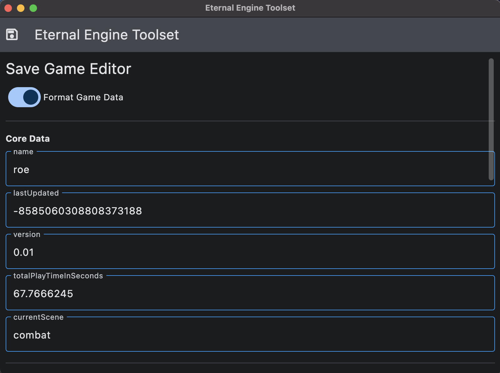
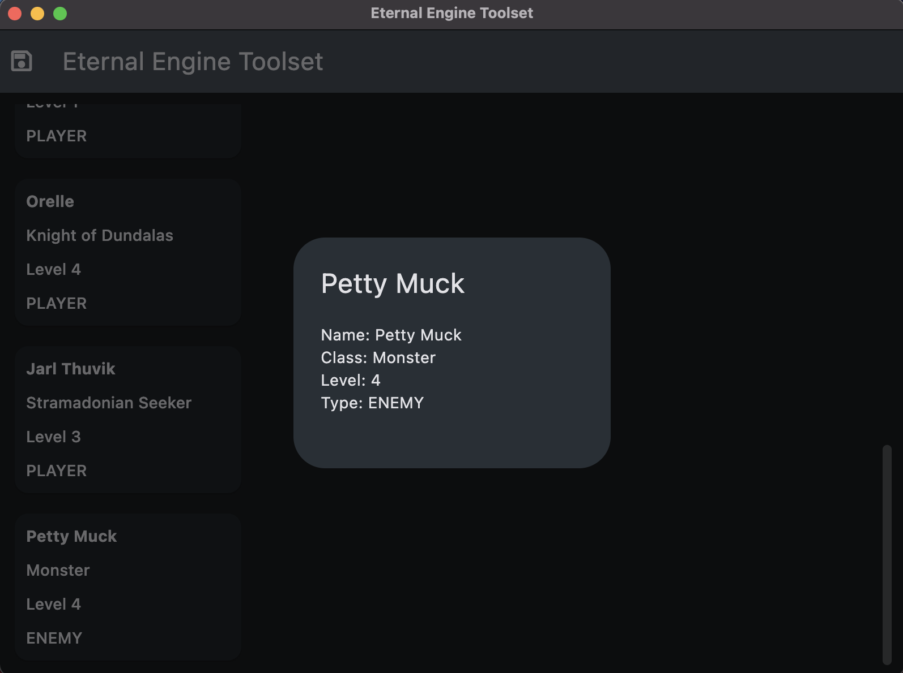

[](https://github.com/lbedner/ee-toolset/actions/workflows/tox.yml)

# Eternity Engine Toolset (ee_toolset)

<p float="left">
  
   
</p>

The Eternity Engine Toolset (ee_toolset) is a suite of utilities designed to aid in the development of an isometric RPG built with Unity. This toolset operates in conjunction with the Eternity Engine to manage various game elements.

## Features
- Manage Units
- Handle Attributes
- Organize Items
- Define Abilities
- Control Scenes

## Technology
Written using the [Flet framework](https://flet.dev/).

## Getting Started
1. Clone this repository.
2. Create a virtual environment.
3. Install `pip-tools`:
   ```bash
   pip install pip-tools
4. Install `requirements.txt`:
    ```bash
    pip install -r requirements.txt
    ``````

## Running The Toolset

1. Desktop Mode:
    ```bash
    flet run ee_tolset.py
2. Web Mode (Including Hot-Reload)
    ```bash
    flet run --web --port 1234 ee_toolset.py
    ``````

## Code Snippets
```python
import flet as ft
from icecream import ic

from app.models.game_data import Unit

# Main application entry point
def main(page: ft.Page):
    title = "Eternal Engine Toolset"
    page.window_height = 600
    page.window_width = 800

    page.appbar = ft.AppBar(
        leading=ft.Icon(ft.icons.SAVE_OUTLINED),
        leading_width=40,
        title=ft.Text(title),
        center_title=False,
        bgcolor=ft.colors.SURFACE_VARIANT,
    )

    page.title = title

    page.scroll = ft.ScrollMode.ALWAYS

# Controllers
class GameDataApp(ft.UserControl):
    def __init__(self, game_data: GameData):
        super().__init__()
        self.game_data = game_data
        self.visible = True

# Models
class GameData(BaseModel):
    name: str
    lastUpdated: int
    version: str
    totalPlayTimeInSeconds: float
    currentScene: str
    units: List[Unit]
